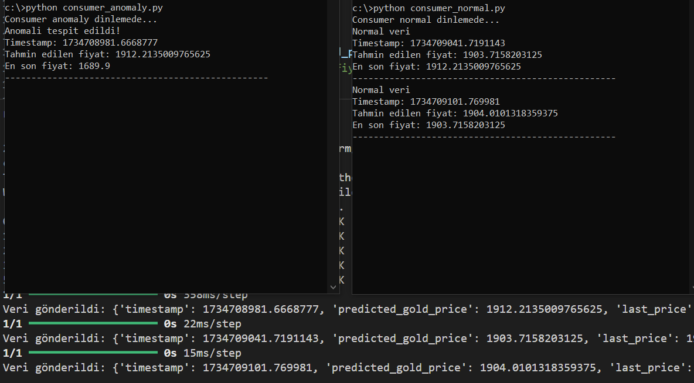

Bu proje büyük veri analizine giriş dersi kapsamında gerçekleştirilmiştir. Bir altın fiyatı veri seti kullanılarak yapay zeka modeli eğitilmiş bu eğitilen model kullanılarak da Kafka ile gerçek zamanlı anomali tespiti yapılmıştır.

